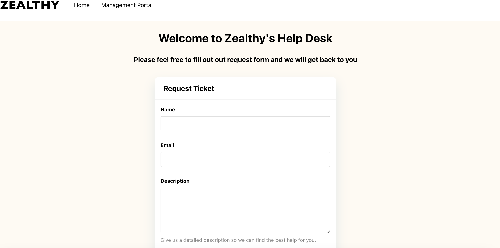

# Zealthy-SE-Exercise

## Deployed Site URL:
https://zealthy-se-exercise-frontend.vercel.app/

## Tech Stack Used
- Vite + React.js, Node.JS, Express.js, PostgreSQL

## To start:
- Fork and clone the application
## Once forked and cloned:
#### Set up Environment Variables:
- Create copies of the sample.env files found in both the client and server directory.
- Server: In your terminal run `cp -p ./server/sample.env ./server/.env.development`
- Client: In your terminal run `cp -p ./client/sample.env ./client/.env.development`
##### Once the .env file has been created
- Frontend: navigate to the frontend directory with `cd client`
- Open another tab in the terminal
- Backend: navigate to the backend directory with `cd server`
- Install all dependencies with `npm install` on both the Frontend and the Backend.

- Start the backend server by running the command `npm start`  
- Start the frontend server by running the command `npm run dev`